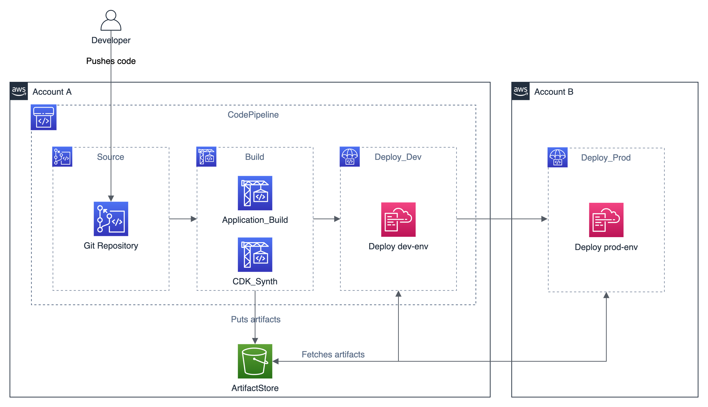

# Cross-account CI/CD Pipeline

This is an example of a CodePipeline cross-account CI/CD pipeline. The pipeline leverages CodeCommit as a Git repository, CodeBuild to package the source code for a sample Lambda and to build a CloudFormation template for our application. Moreover, the pipeline uses CodeDeploy to deploy the sample application. In this example, the pipeline is provisioned on a development account, and deploys the sample application on both the development (the same as the pipeline) and the production account (specified by the user).



This example also configures the S3 bucket ArtifactStore to be accessed from a different AWS account, and the AWS Key Management Service (KMS) key to decrypt the artifacts.

The CDK consists of the following stacks:
- DevApplicationStack: the sample application to be deployed by the pipeline on the dev environment
- ProdApplicationStack: the sample application to be deployed by the pipeline on the prod environment
- CrossAccountPipelineStack: the pipeline itself, along with other resources like CodeBuild, S3, KMS, etc.
- RepositoryStack: a CodeCommit Git repository

## Build

To build this app, you need to be in this example's root folder. Then run the following:

```bash
npm install -g aws-cdk
npm install
npm run build
```

This will install the necessary CDK, then this example's dependencies, and then build your TypeScript files and your CloudFormation template.

## Create Production IAM Roles

On the production AWS Account:
1. Create an IAM Role named `CodePipelineCrossAccountRole`
2. Create an IAM ROle named `CloudFormationDeploymentRole`

## Deploy CodeCommit Repository

Run `cdk deploy RepositoryStack`. This will deploy / redeploy your RepositoryStack to your AWS Account.

## Deploy CI/CD Pipeline

Set a variable named `PROD_ACCOUNT_ID` with the production AWS Account ID

Run `cdk deploy CrossAccountPipelineStack --context prod-account=${PROD_ACCOUNT_ID}`. This will deploy / redeploy your CrossAccountPipelineStack to your AWS Account.

After the deployment, you will see the KMS key used to encrypt / decrypt the objects on the ArtifactStore.

## Configure Production IAM Policies

On the production AWS Account:

1. Add an Inline Policy to the `CodePipelineCrossAccountRole` with this value:
```json
{
    "Version": "2012-10-17",
    "Statement": [
        {
            "Action": [
                "cloudformation:*",
                "iam:PassRole"
            ],
            "Resource": "*",
            "Effect": "Allow"
        },
        {
            "Action": [
                "s3:Get*",
                "s3:Put*",
                "s3:ListBucket"
            ],
            "Resource": [
                "arn:aws:s3:::artifact-bucket-{DEV_ACCOUNT_ID}",
                "arn:aws:s3:::artifact-bucket-{DEV_ACCOUNT_ID}/*"
            ],
            "Effect": "Allow"
        },
        {
            "Action": [ 
                "kms:DescribeKey", 
                "kms:GenerateDataKey*", 
                "kms:Encrypt", 
                "kms:ReEncrypt*", 
                "kms:Decrypt" 
            ], 
            "Resource": "{KEY_ARN}",
            "Effect": "Allow"
        }
    ]
}
```

2. Add an Inline Policy to the `CloudFormationDeploymentRole` with this value:
```json
{
    "Version": "2012-10-17",
    "Statement": [
        {
            "Action": "iam:PassRole",
            "Resource": "arn:aws:iam::{PROD_ACCOUNT_ID}:role/*",
            "Effect": "Allow"
        },
        {
            "Action": [
                "iam:GetRole",
                "iam:CreateRole",
                "iam:AttachRolePolicy"
            ],
            "Resource": "arn:aws:iam::{PROD_ACCOUNT_ID}:role/*",
            "Effect": "Allow"
        },
        {
            "Action": "lambda:*",
            "Resource": "*",
            "Effect": "Allow"
        },
        {
            "Action": "apigateway:*",
            "Resource": "*",
            "Effect": "Allow"
        },
        {
            "Action": "codedeploy:*",
            "Resource": "*",
            "Effect": "Allow"
        },
        {
            "Action": [
                "s3:GetObject*",
                "s3:GetBucket*",
                "s3:List*"
            ],
            "Resource": [
                "arn:aws:s3:::artifact-bucket-{DEV_ACCOUNT_ID}",
                "arn:aws:s3:::artifact-bucket-{DEV_ACCOUNT_ID}/*"
            ],
            "Effect": "Allow"
        },
        {
            "Action": [
                "kms:Decrypt",
                "kms:DescribeKey"
            ],
            "Resource": "{KEY_ARN}",
            "Effect": "Allow"
        },
        {
            "Action": [
                "cloudformation:CreateStack",
                "cloudformation:DescribeStack*",
                "cloudformation:GetStackPolicy",
                "cloudformation:GetTemplate*",
                "cloudformation:SetStackPolicy",
                "cloudformation:UpdateStack",
                "cloudformation:ValidateTemplate"
            ],
            "Resource": "arn:aws:cloudformation:us-east-2:{PROD_ACCOUNT_ID}:stack/ProdApplicationDeploymentStack/*",
            "Effect": "Allow"
        }
    ]
}
```

## License

This library is licensed under the MIT-0 License. See the LICENSE file.